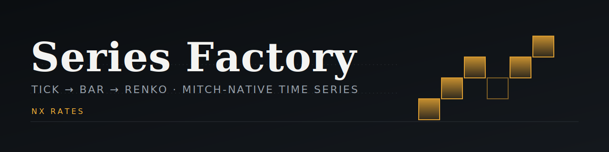

<div align="center">
  
  <h1>Series Factory</h1>
  <p>
    <strong>Historical market time-series ingestion, aggregation, and validation toolkit</strong>
  </p>
  <p>
    <a href="./LICENSE"></a>
    <a href="https://nxrates.com"></a>
    <a href="https://twitter.com/nxrates"></a>
  </p>
</div>

Rust library and CLI toolkit for building research-grade market data series from raw CEX trade archives: download, replay into composite index streams, aggregate into time and adaptive Renko bars, and certify data quality. Includes stochastic model generators (GBM, FBM, Heston, jump-diffusion) for synthetic test series.

---

## Table of Contents
- [Pipeline](#pipeline)
- [Binaries](#binaries)
- [Data Sources](#data-sources)
- [Synthetic Models](#synthetic-models)
- [File Formats](#file-formats)
- [Usage](#usage)
- [Renko Calibration](#renko-calibration)
- [Library Modules](#library-modules)
- [Testing](#testing)
- [Production Role](#production-role)
- [License](#license)

## Pipeline

```
CEX trade archives (ZIP/GZIP CSV)
        │  fetch-crypto-history
        ▼
raw .ticks files (per exchange, MITCH Tick)
        │  ticks-to-idx        200 ms replay of the live forwarder loop
        ▼
per-provider .idx AppendLogs (56 B IndexRecord)
        │  merge-idx           time-decay-weighted average (TDWAP) across providers
        ▼
composite daily-sharded .idx   <root>/indexes/<MITCH_ID>/<YYYY-MM-DD>.idx
        │  s10-from-idx · renko-from-idx
        ▼
daily-sharded bars             <root>/bars/<MITCH_ID>/<YYYY-MM-DD>.{s10,renko}
        │  integrity-check · glue-check · data-quality-audit
        ▼
PASS/FAIL certification
```

`backfill-all` orchestrates the full chain for many tickers in parallel, with resume logic, availability probing, and a JSON report.

## Binaries

### Ingestion and merge

| Binary | Purpose |
|--------|---------|
| `fetch-crypto-history` | Download aggTrades/tick archives per (pair, exchange) into `.ticks` files; `--probe` mode HEAD-checks archive coverage |
| `ticks-to-idx` | Replay raw `.ticks` into a per-provider `.idx` AppendLog (200 ms cycle, z-score outlier gate) |
| `merge-idx` | TDWAP-merge per-provider `.idx` files into a composite daily-sharded `.idx` directory |
| `backfill-all` | Orchestrator: fetch, ticks-to-idx, merge, s10, renko, validate; parallel tickers, resume, JSON report |
| `synth-backfill-from-idx` | Rebuild synthetic cross-pair bars (e.g. ETH-BTC) from the two leg `.idx` streams |

### Bar construction

| Binary | Purpose |
|--------|---------|
| `s10-from-idx` | Uniform 10 s OHLC bars (96 B `mitch::Bar`, full microstructure section) from composite `.idx` |
| `renko-from-idx` | Adaptive Renko bricks; brick size re-calibrated every 30 min from a Rogers-Satchell sigma `.vol` file |
| `renko-trailing-from-idx` | Walk-forward Renko backfill: per-day `k(D)` calibrated only on data before day `D` (no look-ahead) |
| `vol-from-s10` | Build an id-keyed `.vol` sigma file from persisted `.s10` shards |

### Calibration

| Binary | Purpose |
|--------|---------|
| `nxr-calibrate` | Daily offline calibration of the Renko brick multiplier per ticker (MTF binary search on a target bricks/day) |
| `window-sweep` | Walk-forward sweep answering which `rolling_window_days` minimizes bricks/day calibration error |

### Validation and maintenance

| Binary | Purpose |
|--------|---------|
| `integrity-check` | Structural validation of `.idx`, `.s10`, `.bars`, `.vol` files; CI smoke gate and post-pipeline assertion |
| `glue-check` | Seam validator for the backfill/live `.idx` join: monotonicity, cross-shard continuity, gap bounds |
| `data-quality-audit` | Per-ticker PASS/FAIL certifier: zero unexplained gaps, microstructure invariants, statistical fingerprint |
| `renko-continuity-check` | Cross-shard brick continuity, bricks/day median and MAD, s10 grid continuity |
| `live-latency-audit` | Wall-clock lag of live shard tips vs SLA budgets |
| `resample-idx` | Down-sample `.idx` shards to a coarser cadence (last-in-bucket, e.g. 100 ms to 200 ms) |
| `migrate-to-sharded` | One-time migration of flat/composite legacy layouts into the MITCH-ID daily-sharded layout |
| `heal-idx` | Repair sharded `.idx` in place: sort, resample, re-shard |

## Data Sources

| Exchange | Format | History from | Notes |
|----------|--------|--------------|-------|
| Binance | ZIP/CSV | 2017 (monthly), 2021 (daily) | Monthly archives for completed months, daily for the current month |
| Bybit | GZIP/CSV | 2019 | Monthly plus daily for the current month |
| OKX | ZIP/CSV | 2021 | Daily files, dash-separated symbols (BTC-USDT) |
| Bitget | ZIP/CSV | 2021 | Daily files, sequential chunks (001-N) |

Archive URL templates are YAML-driven (`cexs.exchanges.<name>.archive_url_template` in the pipeline config); no URLs are hardcoded. Sources convert trades to ticks pessimistically: market sells set the bid, market buys set the ask, and the other side is forward-filled.

## Synthetic Models

The `sources::synthetic` module implements `TickSource` for five stochastic processes (500 ms tick epoch, parameters annualized):

| Model | Parameters |
|-------|------------|
| Geometric Brownian Motion | `mu, sigma, base` |
| Fractional Brownian Motion | `mu, sigma, hurst, base` |
| Heston stochastic volatility | `mu, sigma, kappa, theta, xi, rho, base` |
| Normal jump-diffusion (Merton) | `mu, sigma, lambda, mu_jump, sigma_jump, base` |
| Double-exponential jump-diffusion (Kou) | `mu, sigma, lambda, mu_pos_jump, mu_neg_jump, p_neg_jump, base` |

Construct via the library: `create_source(&DataSource::Synthetic(GenerativeModel::GBM { mu, sigma, base }))`. Each synthetic instance gets a distinct provider id, so multiple synthetic sources feed the aggregator as independent providers.

## File Formats

All on-disk types are MITCH protocol structs: `#[repr(C, packed)]`, `bytemuck::Pod`, read via mmap and zero-copy cast. Timestamps are MITCH `mts`, a 6-byte u48 LE counting 16 microsecond ticks since 2010-01-01 UTC.

| Extension | Record | Size | Content |
|-----------|--------|------|---------|
| `.ticks` | `mitch::TickFrame` | 48 B | 16 B MITCH header + 32 B tick: timestamp, bid, ask, vbid, vask |
| `.idx` | `IndexRecord` | 56 B | composite index: mid, confidence, volumes, flags |
| `.s10` | `mitch::Bar` | 96 B | 10 s OHLC kline, 64 B OHLCV + 32 B microstructure |
| `.renko` | `mitch::Bar` | 96 B | adaptive Renko brick, same layout |
| `.vol` | `VolRecord` | 14 B | (mts, Rogers-Satchell sigma) per 30-min bin, EMA-smoothed |

Per-bar microstructure section: realized variance, bipower variance (jump-robust, Barndorff-Nielsen and Shephard 2004), OLS drift, signed volume imbalance (OFI), average spread in bps, max absolute return, quality metadata.

Sharded layout (single source of truth in `nxr_sdk::shard`):

```
<root>/indexes/<MITCH_ID>/<YYYY-MM-DD>.idx
<root>/bars/<MITCH_ID>/<YYYY-MM-DD>.{s10,renko}   + manifest.json
```

Files are append-only streams with no file-level header (each `.ticks` record embeds its own 16 B MITCH header); record count = file size / record size from the table above.

## Usage

Build (requires the sibling `mitch` and `sdk` checkouts of the parent nx-rates repository, referenced as path dependencies):

```bash
cargo build --release
```

Fetch one year of BTC and ETH history from two exchanges:

```bash
fetch-crypto-history config.yml --pairs BTC,ETH --exchanges binance,bybit --days 365
```

Replay raw ticks into a per-provider index, then merge providers into a composite:

```bash
ticks-to-idx binance BTC USDT --cycle-ms 200 --z 6.0
merge-idx BTC USDT --exchange binance --exchange bybit --weight binance=40 --weight bybit=30
```

Build bars from the composite:

```bash
s10-from-idx config.yml BTC-USDT
renko-from-idx config.yml BTC USDT
```

Or run the whole chain for a ticker set:

```bash
backfill-all config.yml --tickers BTC-USDT,ETH-USDT --from 2024-01-01 --resume
```

Validate:

```bash
integrity-check dir /data --parallel 4
glue-check --all --data-root /data
data-quality-audit --data-root /data --json
```

Paths default to the standard environment (`$NXR_DATA_TICKS`, `$NXR_DATA_INDEXES`, `$NXR_DATA_BARS`); every offline binary accepts explicit overrides.

## Renko Calibration

Adaptive Renko brick size is `price * clamp(m * sigma_blend, b_min, b_max)`, where `sigma_blend` is the EMA-smoothed Rogers-Satchell sigma over 30-min OHLC bins built from gapless `.s10` bars. The multiplier `m` is calibrated per ticker against a target brick density (bricks/day, default 300) by direct binary search (`scale_to_target_k`).

Two calibration regimes:

- `nxr-calibrate`: daily cron; fits `m` on a trailing window, writes `ticker-params.json` atomically.
- `renko-trailing-from-idx`: historical backfill; re-fits `k(D)` for every UTC day `D` using only data with `ts < D_start`, so backtests on the output contain no look-ahead. Calibration granularity matches apply granularity (full ticks, not downsampled), which matters: a 1-min downsample biases `k` 3-5x small.

`window-sweep` selects the rolling window length empirically by walk-forward error rather than judgment.

## Library Modules

- `sources/`: exchange archive downloaders (Binance, Bybit, OKX, Bitget) + synthetic generators, all behind the `TickSource` trait.
- `bar_construction/`: `.vol` builder (Rogers-Satchell sigma over s10 OHLC) and Renko multiplier calibration (`scale_to_target_k`).
- `sharding.rs`: thin re-export of the canonical `nxr_sdk::shard` daily-shard primitives.
- `seam.rs`: cross-shard continuity invariants shared by tests and checker binaries.
- `idx_heal.rs`: in-place `.idx` repair (sort, resample, re-shard).
- `vol_bin.rs`: zero-copy `.vol` mmap reader/writer.
- `types.rs`: config plus re-exports of `mitch::TickFrame` and `mitch::bar::Bar`.

Streaming Renko engine, sigma blending, OHLC rollup, and TDWAP live in the shared `nxr-sdk` crate; this repo holds the offline tooling.

## Testing

```bash
cargo test
```

Integration tests cover seam continuity between offline and live shards (`seam_joint_offline_live`), sentinel-aware gap handling (`seam_sentinel_skip`), integrity-check smoke (`integrity_smoke`), and a bricks/day acceptance gate (`bpd_acceptance`, `--ignored`, requires real shards; asserts the per-ticker median is within 15% of target).

## Production Role

These binaries run in the NX Rates pipeline: `backfill-all` and the checkers run as Kubernetes Jobs/CronJobs against the live data volume, `nxr-calibrate` refreshes Renko multipliers daily, and the bar-construction code paths are byte-for-byte identical to the live s10/renko producers, so offline history and the live stream join without seams. Offline defaults (200 ms cycle, z-gate 6.0, TDWAP weights) deliberately mirror the live aggregator configuration.

## License

MIT. See [LICENSE](LICENSE).
